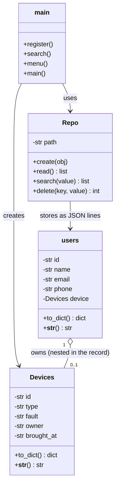
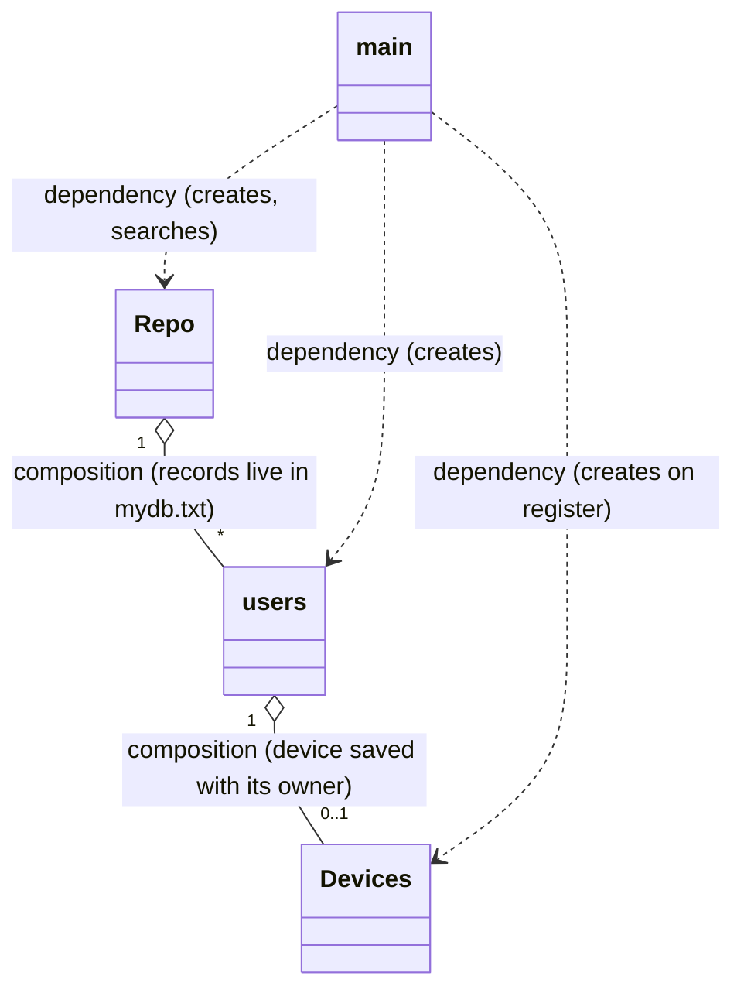

** 
STORE RECORDS
**

MEDIA- FILE STORAGE

FUNCTIONAL REQUIREMENTS:

#  ADD A RECORD, DISLPAY,SEARCG  CALCULATE DATA ,

STAKEHOLDERS

// electronics shop

->   client, technician ,receptions

# ENTITIES:

### USERS,DEVICES 

# functional requirements 
 a repository to store data

---

## How it works

Run the app:

```bash
python3 main.py
```

Menu:

```
1) Register
2) Search
3) Exit
```

- **1 Register** - asks for `name`, `email`, `phone`, the `device for repair` and the `issue`.
  The email is re-asked in a `while` loop until it contains `@` and `.`.
  A `Devices` object is created (with a UTC timestamp) and saved inside the record in `mydb.txt`
- **2 Search** - one query, matched against `name`, `email` and `phone` (partial match allowed),
  then prints which device that person brought for repair and at what UTC time
- **3 Exit** - closes the app

`mydb.txt` format (one JSON object per line):

```json
{"id": "2f1c...", "name": "ferouz", "email": "f@mail.com", "phone": "0712345678", "device": {"id": "aa11...", "type": "xiaomi", "fault": "charging", "owner": "f@mail.com", "brought_at": "2026-10-05 13:32:28 UTC"}}
{"id": "9b44...", "name": "adlan", "email": "a@mail.com", "phone": "0799999999"}
```

Example search output:

```
ferouz | f@mail.com | 0712345678 | 2f1c...
   f@mail.com brought this item for repair at 2026-10-05 13:32:28 UTC
   Device: xiaomi - charging
```

---

## Class diagram



## Relations



| Relation | Meaning |
|---|---|
| `main ..> Repo` | dependency - `main` calls `Repo.create()` and `Repo.search()` |
| `main ..> users` | dependency - `main` builds a `users` object to save |
| `main ..> Devices` | dependency - `register()` builds a `Devices` object on every registration |
| `Repo o-- users` | composition - the repository owns the records, one `Repo` holds many `users` |
| `users o-- Devices` | composition - the device is nested inside the record of the person who brought it |
